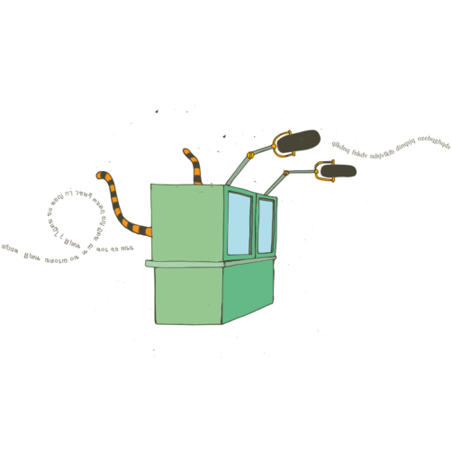

# COATI: Synchrone vertolking met behulp van radiofrequenties

***Colectivo para la Autogestión de las Tecnologías de la Interpretación***

> *"Internationale solidariteit en wereldwijd protest is niets nieuws. Van de
> Europese revoluties van 1848, via de omwentelingen van 1917-18 na de
> Russische Revolutie, tot de flitsen van verzet bijna overal in 1968, de
> strijd is altijd in staat geweest om te communiceren en elkaar wereldwijd te
> inspireren. Maar wat misschien uniek is voor onze tijd is de snelheid en het
> gemak waarmee we kunnen communiceren tussen de verschillende strijden en het feit dat de
> globalisering ertoe heeft geleid dat veel mensen die in zeer uiteenlopende
> culturen leven over de hele wereld nu een gemeenschappelijke vijand delen"*
> – Do or Die, Issue 8, 1999

> *"Ons verzet is net zo transnationaal als het kapitaal"*
> – Slogan van de wereldwijde actiedag tegen het kapitalisme, 18 juni 1999

Naarmate de economie steeds meer transnationaal wordt, wordt ook het verzet
tegen de verwoestende sociale en ecologische gevolgen ervan dat.
Internationaal verzet betekent het samenkomen van verschillende strijdbewegingen en culturen om elkaar te ontmoeten, ideeën en ervaringen te delen en acties te coördineren. Grenzen en culturen overschrijden betekent op deze manier ook het communiceren over taalbarrières heen, en taal gaat over macht.

Veel internationale bijeenkomsten worden in meer 'internationale' talen gehouden zoals Engels, Spaans, Russisch of Frans.
Veel mensen spreken deze talen, maar dat komt omdat ze een lange geschiedenis van imperialisme hebben: zij werden onder dwang en in veel gevallen op brute wijze opgelegd aan mensen uit veel verschillende culturen, verslonden lokale talen en roeiden culturele diversiteit uit. Ze kunnen ons helpen te communiceren, maar zijn vaak niet de moedertaal van mensen. Mensen die in een vreemde taal deelnemen kunnen onzeker zijn of ze alles goed begrepen hebben of missen vertrouwen dat ze zich goed kunnen uitdrukken. Daarom hebben moedertaalsprekers van imperialistische talen (voornamelijk Engels) in het verleden gedomineerd en blijven ze onze bijeenkomsten overheersen.

Als we streven naar diversiteit, basisparticipatie of consensus bij besluitvorming moeten we het bewustzijn vergroten van deze machtsdynamiek en bijhorende processen van inclusie en uitsluiting. Het vergroten van de gelijkheid bij onze communicatie en het scheppen van ruimte voor sprekers van andere talen is een belangrijke politiek strijd. Eén waardevol instrument om dit aan te pakken is het aanbieden van vertolking tussen talen zodat iedereen kan communiceren in een taal waarbij mensen zich prettig voelen.

Tolken tussen twee talen is een kunst die zo oud is als talen zelf en vereist geen technologie. Maar, om praktisch te zijn bij grotere meetings met meerdere talen, moet het simultaan zijn. Meerdere talen simultaan tolken kan niet zonder technologie.

## Een geschiedenis van alternatieve tolktechnologieën

De eerste poging om technologie te gebruiken om dit soort tolken mogelijk te maken was bij de Neurenbergprocessen na de Tweede Wereldoorlog, met behulp van een systeem gebaseerd op de telefoon [^1]. Sindsdien is de technologie, meestal gebaseerd op infraroodtransmissie, verder ontwikkeld bij internationale organisaties zoals de VN en de EU. Ondertussen is het zeer geavanceerde technologie, maar extreem duur en buiten bereik voor de meeste activistische vrijplaatsen en sociale bewegingen. Zelfs als een event het zich kan veroorloven om apparatuur te huren, lopen de kosten al snel torenhoog op, zelfs op kleine schaal.

De Europese en mondiale sociale forums (ESF en WSF) die plaatsvonden tussen 2001 en 2010 waren internationale evenementen op grote schaal, met tot 100.000 deelnemers en honderden parallelle vergaderingen per dag. Aanvankelijk was vertolking zeer beperkt, vanwege de kosten, maar sommige mensen waren zich al snel bewust van het belang van taal in het politieke proces. Babels, een netwerk van vrijwillige tolken, was geboren.

Tolken en tolktechnologie werden onderdeel van het politieke proces. Tolken is het gemakkelijkst in grote plenaire vergaderingen, waar maar een paar mensen spreken en de meesten vooral luisteren. Bij participatief organiseren moet er in kleine groepen gewerkt worden, zodat meer mensen de kans hebben om input te leveren, maar dit verveelvoudigt het aantal vereiste tolken. Daarom hebben beslissingen over tolken een directe invloed op de dynamiek van een evenement. De buitensporige kosten van commerciële technologie en tolken beperken de beschikbare hulpmiddelen en er is niet zoiets als een zuiver technische keuze. Zelfs als er budget voor zulke diensten is, is het eenmalig: je geeft het aan een commercieel bedrijf en het is weg. Het alternatief is "Do it Yourself:" investeren in mensen en materieel en op die manier de mogelijkheden en de autonomie van de sociale bewegingen vergroten.

Tijdens het ESF in 2003 in Parijs hebben meer dan 1000 vrijwilligers geholpen met vertolking en elke plenaire vergadering en workshop vond plaats in verschillende talen. De gebruikte technologie was echter commercieel en de kosten waren astronomisch. Zulke commerciële tolktechnologie is sindsdien nooit meer ingezet op zo'n grote schaal. Het was de inspiratie voor eerste experimenten met alternatieve tolktechnologie. Aanvankelijk waren deze gebaseerd op computers, maar door de digitalisering ontstond er een grote vertraging die het publiek en de tolken verwarde. Bij het WSF 2004 in Mumbai, India, werd de piste van computers verlaten en gekeken naar meer low-tech oplossingen, analoge audio: zowel met kabels als FM-radio. In Griekenland werd het collectief ALIS opgericht (Alternative Interpreting Systems, Alternatieve Tolksystemen) om tolkinfrastructuur te voorzien voor het 2006 ESF in Athene. Voortbordurend op de blauwdrukken en ervaringen van eerdere groepen met analoge tolkconsoles, bouwden ze maandenlang om genoeg apparatuur te hebben voor het hele event.

Athene was het eerste (en voor Sociale Forums helaas het enige) grootschalige
politieke evenement dat alternatieve tolktechnologie an sich als een politiek
vraagstuk beschouwde en daar ook de nodige ruimte en middelen aan gaf. Het
resultaat was een ongekend succes. Infrarood zenders zijn zeer dure apparaten,
angstvallig bewaakt door hun commerciële eigenaren die van huurders eisen dat ze
een paspoort of kredietkaart in borg geven in ruil voor het gebruik. In
Athene waren vertalingen beschikbaar voor iedereen met een FM-radio. Sommige
versies van dat systeem worden vandaag de dag nog steeds gebruikt, waardoor
mensen met een ordinaire radio of smartphone toegang krijgen tot de tolken.

Ondanks het succes van Athene was de ervaring bij de Sociale Fora dat over het algemeen de vele inspanningen van tolken en technici volledig onbruikbaar werden gemaakt door een gebrekkige politieke en technische steun tijdens deze evenementen. Bovendien was er geen enkele steun tussen de evenementen, wanneer materieel moest worden gekocht of gebouwd, opgeslagen, vervoerd, getest en gerepareerd. In tegenstelling tot commerciële apparatuur die gehuurd wordt voor de duur van een evenement, moet zelfbeheerde apparatuur tussen evenementen worden opgeslagen, vaak in grotere hoeveelheden dan nodig voor een bepaald event. Mensen moeten worden opgeleid in de werking, logistieke problemen moeten worden opgelost en er zijn administratieve lasten, dat vraagt allemaal om middelen en langdurige inzet. De Sociale Fora weigerden die les te leren, maar andere sociale bewegingen zijn hier wel mee aan de slag gegaan.

## COATI: het COllectief voor Autonomie in TolktechnologIe

COATI werd opgericht in Barcelona in 2009, het bracht mensen bijeen uit de antikapitalistische en antiglobaliseringsbeweging. We hadden de boeren ondersteund van Via Campesina bij de oprichting van de beweging voor Voedselsoevereiniteit. We hadden vrijwilligerswerk gedaan als tolk – soms in zeer precaire omstandigheden – en zagen de meerwaarde van alternatieve technologie. We hadden geleerd hoe ons horizontaal en consensugebaseerd te organiseren in de Do-It-Yourself cultuur van de anarchistische en antikapitalistische sociale centra in heel Europa.
We hadden een goed begrip en inzicht gekregen in de technologie in hacklabs in kraakpanden en bij de vrije software communities. We leerden over de sound systems die werden gebruikt op hardcore punkfestivals, straatfeesten en bij vrije radio's. Het waren die ervaringen en de waarden van deze gemeenschappen die de inspiratie vormden voor het project.

We nodigden iemand van het oorspronkelijke ALIS collectief uit om naar Barcelona te komen en ons op te leiden in hoe hun apparatuur werkte. We begonnen zoveel mogelijk van de oude alternatieve technologie op te sporen als we konden (het grootste deel was in magazijnen opgestapeld of was stof aan het verzamelen in vergeten dozen in campagnebureaus). We wilden de taaldiversiteit vergroten en ons plan was om de apparatuur te verzamelen en beheren, zodat niet ieder event zelf deze problemen vanaf de grond moest oplossen. We leerden echter snel dat voor een betere toegang tot tolktechnologie meer nodig zou zijn dan alleen het beheer van de apparatuur en een verlaging van de kosten.

### Alternatieve technologie voor mensen laten werken

De eerste uitdaging was het overwinnen van de tegenstand tegen het gebruik van alternatieve technologie, die vaak voortkwam uit slechte ervaringen die mensen in het verleden met de apparatuur hadden opgedaan. Binnnen sociale bewegingen ontworpen, was de kwaliteit inferieur aan die van commerciële apparatuur. Het was gebouwd met als opzet de kosten drastisch te verlagen, met goedkope onderdelen, niet specifiek voor audio ontworpen. De tolken en het publiek werden geplaagd met een elektrisch brommen en zoemen dat vermoeiend was om naar te luisteren.

Een belangrijk deel van onze oplossing was om simpelweg de technologie als een essentieel onderdeel te zien. We hebben onszelf getraind. Overal waar onze spullen heen gingen, was er altijd een specifiek persoon aangesteld die verantwoordelijk was voor de bediening ervan. Veel van de problemen uit het verleden werden veroorzaakt omdat alternatieve technologie een bijzaak was, zodat niemand de tijd had om er voor te zorgen dat het goed werkte. We leerden door te doen. We hebben veel tijd besteed aan het zoeken naar de oorzaken van problemen en het aanpassen van het materiaal, het toevoegen van kleine schakelingen om te filteren of signalen te versterken en de geluidskwaliteit te verbeteren.

De apparatuur die was gebouwd door het Griekse collectief kwam zonder schema's, wat dit werk aanzienlijk bemoeilijkte. 
Uren van reverse engineering waren nodig voordat we dingen konden aanpassen. Nu is de apparatuur bijna 10 jaar oud en we worden geconfronteerd met de uitdaging om nieuwe open source consoles te ontwerpen en bouwen, uit het niets.
We zijn ons zeer bewust van het nut van een open-source design, en al het elektronische werk dat we hebben gedaan is volledig gedocumenteerd en online beschikbaar [^2].

### Mensen met alternatieve techonologie laten werken

Het overwinnen van technologische problemen was niet de enige uitdaging waar we voor stonden.
Sommige van de moeilijkste kwesties vloeiden voort uit de politieke en organisatorische culturen van de beweging zelf.
Veel groepen zijn relatief informeel georganiseerd en mensen verzetten zich soms tegen de discipline die simultaan tolken vereist: mensen moeten langzaam en duidelijk spreken; microfoons gebruiken zodat de tolken hun kunnen horen en mensen mogen elkaar niet in de rede vallen.
Grotere netwerken en NGO's hebben mischien meer ervaring met tolken, maar ze behandelen het vaak als een louter technische hulp die zoveel mogelijk onzichtbaar moet zijn en niet als een belangrijk onderdeel van het politieke proces. Ze geraken gefrustreerd door de eisen van solidair tolken en alternatieve technologieën om participatie en politieke betrokkenheid mogelijk te maken. Hoe vlot de technologie ook werkt, zal tolken nooit automatisch de machtsdynamiek van taal elimineren en het blijft ieders verantwoordelijkheid om ruimte te scheppen voor minderheidstalen.

Een ander belangrijk aspect van het werk van COATI was dan ook het werken aan de politieke cultuur die alternatieve tolktechnologie nodig heeft om echt te kunnen werken.

### Vrijwillig tolken

Alternatieve technologie kan worden gebruikt door commerciële tolken en vrijwillige tolken kunnen in commerciële cabines werken.
In de praktijk echter zijn beide verwant en hebben ze zich naast elkaar ontwikkeld. Een belangrijk element bij het organiseren van een evenement is vaak het vinden van vrijwilligers met de juiste vaardigheden om aan de taalbehoeften te voldoen. Dit kan opgelost worden door naar tolken te zoeken die bereid zijn gratis te werken, uit solidariteit, omdat ze werkervaring nodig hebben of omdat hun reis- en verblijfskosten worden vergoed naar exotische plaatsen. Deze relatie verwordt echter gemakkelijk tot één van goedkope dienstverlening, waarbij vrijwilligers weinig belangstelling hebben voor de politieke kwesties die worden besproken; de daaruit voortvloeiende kosten kunnen hoog zijn, zelfs als het werk gratis wordt gedaan.

Een belangrijk deel van ons werk bestaat daarom in het helpen om bewegingen zelf de vaardigheid op te bouwen voor simultane vertalingen binnen hun eigen basisorganisatie. Hoe groter een evenement is, hoe complexer dit proces wordt. Een heel stuk zou geschreven kunnen worden over de politieke en technische vraagstukken die daarbij komen kijken. Het volstaat om te zeggen dat dit een heel belangrijke kwestie is. We hebben een tweedaagse training ontworpen voor activisten met taalvaardigheden en we proberen altijd om vaardigheden uit te wisselen met de tolkteams die we coördineren, waarbij meer ervaren tolken gekoppeld worden met nieuwe activistische vrijwilligers in onze cabines.

### Spreken voor tolken

Een ander belangrijk aspect van de verandering van de politieke cultuur was het in de schijnwerpers brengen van de taaldiversiteit onder de deelnemers van internationale evenementen. Overal waar we werken, proberen we een politieke en praktische inleiding te geven op de apparatuur en hebben we geschreven leidraden voor het spreken in meertalige meetings [^3].
We moedigen mensen aan om actief na te denken over de taal die ze spreken. Zo vragen we bijvoorbeeld deelnemers om niet de taal van de meerderheid te spreken tijdens de meeting, zelfs als ze dat zouden kunnen, omdat het anderen die een beroep moeten doen op de tolken, marginaliseert, waardoor ze in verlegenheid gebracht worden, zich onderontwikkeld of schaamte voelen en zijn daardoor minder geneigd om deel te nemen. We hebben geëxperimenteerd om het onzichtbare tolkmodel op zijn kop te zetten, waarbij we de cabines in het midden plaatsten en de sprekers vanuit de zaal aan het woord lieten, zodat iedereen zich bewust werd van de processen.

### Ontwerpen van flexibele oplossingen voor politieke behoeften

Tolken legt onvermijdelijk beperkingen op aan wat op een vergadering of bijeenkomst kan. Simultaan tolken is het best geschikt voor een vrij hiërarchische organisatievormen zoals het traditionele conferentiemodel. Wij zetten ons echter in voor een niet-hiërarisch organisatiemodel en daarom is het voor ons een prioriteit om de methodes, behoeften en middelen van een groep te begrijpen en zo af te stemmen met de technologische mogelijkheden.

Dit proces bestaat uit twee hoofdonderdelen. Eén is om nauw samen te werken met de organisatoren van het evenement om hun politieke doelstellingen te begrijpen en hun te helpen om het tolken en de technologie erachter te begrijpen, en hoe deze een invloed hebben op verschillende technieken van faciliteren en vergaderdynamiek. Het andere is er één van een creatieve aanpak met de apparatuur: kleine hacks met mixers en splitters, andere bedrading of een houtje-touwtje aanpak om de apparaten (soms met plakband) aan elkaar te bevestigen op een onconventionele manier om ze te laten doen wat we nodig hebben.

We hebben een schat aan ervaring opgebouwd door de grenzen op te zoeken en te verleggen van wat kan worden gedaan om de typische vergaderformaten te doorbreken, zelfs in soms extreme situaties. Op de tweede Nyeleni bijeenkomst in Cluj-Napoca (Roemenië) in 2016 hebben we tolken en appratuur georganiseerd om met meer dan 400 deelnemers met experimentele participatieve methodes in meer dan negen talen te werken. We werken nu aan een technische en politiek handleiding voor facilitatie in meerdere talen.

### De grootste uitdaging: decentralisatie

De afgelopen zeven jaar hebben we met vele groepen en bewegingen gewerkt om helpen bij het oplossen van de taalvereisten van hun internationale evenementen.
Heel vaak betekent dit dat we zowel alle benodigde technologie en technici leveren, als het coördineren van de vrijwillige tolken voor het evenement. Soms zijn er ook gemengde oplossingen waarbij we organisaties helpen hun eigen appratuur te maken en zo capaciteit opbouwen om in hun eigen tolkbehoeften te voorzien.
Wij geloven dat echte technologische soevereiniteit betekent dat groepen niet een beroep moeten doen op "deskundigen", maar zelf in hun technologische noden moeten kunnen voorzien. Een van onze grootste projecten was dan ook ontwikkeling van eenvoudige, gebruiksvriendelijke open-source hardware.

## De *Spider:* een open-source hardwareproject

De eenvoudigste vorm van tolktechnologie is waarschijnlijk de "Spider:" (spin) een kleine doos waar een microfoon insteekt, met koptelefooningangen voor zowel de tolken als het publiek, zodat het geheel eruitziet als een grote, slungelige spin!

Vergeleken met FM-radio of andere draadloze technologie, zijn Spiders goedkoop en zeer eenvoudig te bedienen. Spiders zijn kleinschalige apparaten, het beste geschikt voor kleinere meetings, hoewel we ze in extreme situaties gebruikten op evenementen met honderden deelnemers! De reële schaalbaarheid van het project ligt in het feit dat elke organisatie er één kan hebben, waardoor ze volledig autonoom in veel van hun eigen tolkbehoeften kunnen voorzien.

Jarenlange ervaring vloeiden in de ontwikkeling en productie van onze eigen open source versie van de *Spider*, met vele verbeteringen, zoals modulaire uitbreidingen waarmee groepen tot 12 luisteraars kunnen worden toegevoegd.

We bouwen onze Spiders met de hand, voor eigen gebruik en verkoop. Wij verkopen ook bouwpakketten tegen kostprijs. Alle schema's, onderdelenreferenties en volledige bouwinstructies worden online [^2] gepubliceerd onder de GNU General Public License.

## Nieuwe tech-collectieven trainen

Sinds het Spider-project online ging, hielden we een aantal elektronicaworkshops, om mensen te trainen zodat ze hun eigen Spiders konnen bouwen. We kennen ook ten minste één groep, in Oekraïne, die Spiders heeft gebouwd zonder ons ooit te hebben gecontacteerd. We nodigen technici van andere groepen uit om mee te doen aan grote evenementen en zodat ze kunnen zien hoe de technologie in de praktijk werkt. We hebben deelgenomen aan een aantal skill-sharing weekends, waarbij expertise uitgewisseld en gedeeld wordt, zodat nieuwe roepen kunnen starten. We namen deel aan de oprichting van nieuwe collectieven, in Roemenië [^4] en Polen [^5], die Spiders gebruiken en proberen eigen antwoorden te verzinnen op hun tolknoden. Ook bij Bla [^6], een internationaal collectief, waren we bij de oprichting betrokken. Ze hebben Spiders en kleine radiokits die naar verschillende evenementen in Europa reizen.

## Conclusies

Soevereiniteit bij tolktechnologie is veel dingen voor ons gaan betekenen. Op de eerste plaats om de toegang tot tolktechnologieën uit te breiden tot verzetsbewegingen, was het nodig om de kosten te verlagen en de ontwikkeling van hoogwaardige alternatieve oplossingen die echt werken met een lange levensduur. Dat was echter niet de enige uitdaging. Veel politiek werk moet nog worden verricht om de weerstand van mensen tegen het gebruik van tolktechnologie te overwinnen om onze vergaderingen en bijeenkomsten te openen zodat anderstalige sprekers op gelijke voet kunnen deelnemen. Er is behoefte aan het delen van vaardigheden en kennis over de technische aspecten van tolken en hoe deze op verschillende manieren interageren met de dynamiek bij het faciliteren. Opensource-onderzoek en -ontwikkeling die gericht is op het maximaliseren van de technologische soevereiniteit moet zijn gepaard met capaciteitsopbouw en politieke mobilisatie, teneinde mensen bewuster te maken van het waarom en hoe zij de technologie zouden moeten gebruiken, en om hen in staat te stellen hun eigen oplossingen echt te beheersen en te creëren.

***Voor meer informatie over COATI en het werk dat we doen, zie:***
https://coati.pimienta.org

[^1]: http://www.pri.org/stories/2014-09-29/how-do-all-those-leaders-un-communicate-all-those-languages

[^2]: Al de aanpassingen en elektrische schema's die we gebruiken kunnen hier gevonden worden: https://coati.pimienta.org/electronics

[^3]: Onze leidraad kan hier worden gelezen: https://coati.pimienta.org/documents/

[^4]: Grai Collective, Romania: grai@riseup.net

[^5]: Klekta Collective, Poland: klekta@riseup.net

[^6]: Bla Collective (internationaal): https://bla.potager.org 
